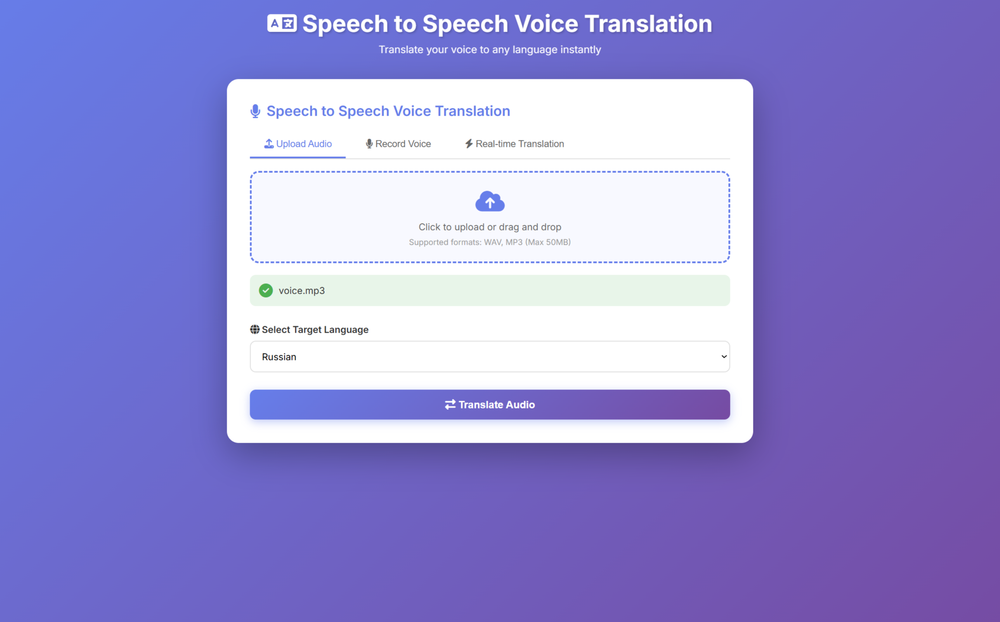
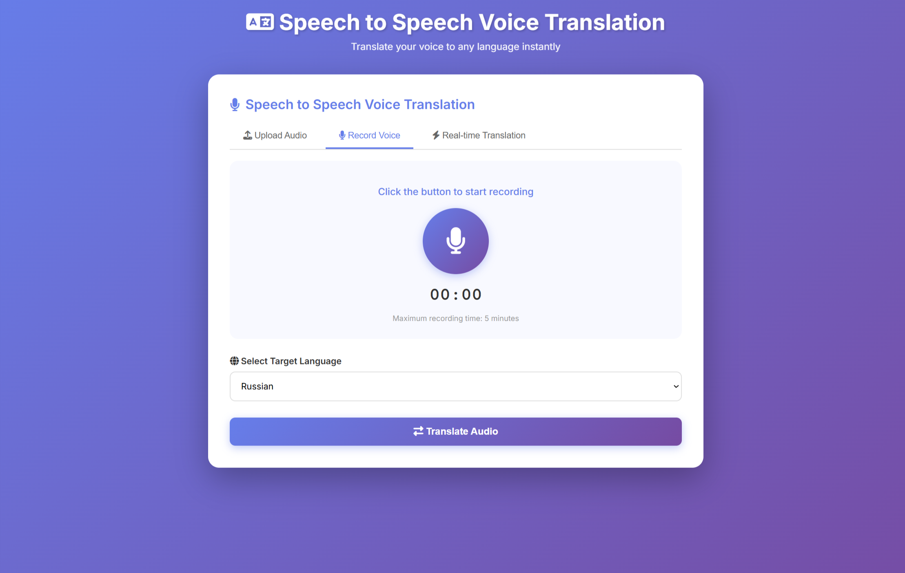
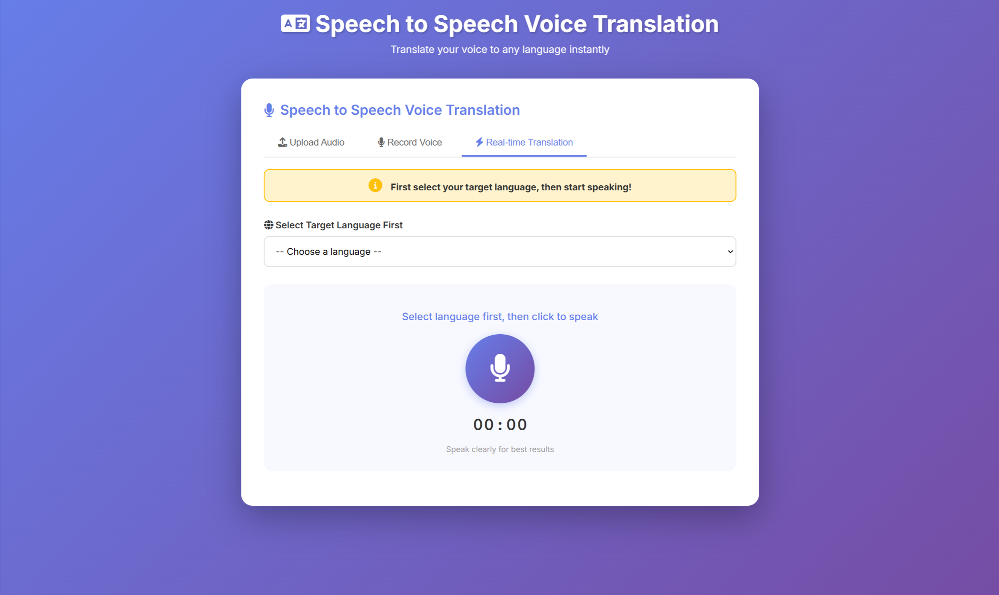

# Speech to Speech Voice Translation

A modern web application for real-time speech-to-speech translation powered by Meta's SeamlessM4T v2 Large model. Translate spoken audio between 12+ languages with high accuracy and natural-sounding output.


## 🖼️ Screenshots

Below are a few screenshots of the web interface. You can find the original images in the `static/image` folder.







## ✨ Features

- **🎤 Real-time Voice Recording** - Record audio directly in your browser
- **📁 File Upload Support** - Upload pre-recorded MP3/WAV files
- **🌍 12+ Languages** - Translate between Bengali, English, Spanish, Chinese, Arabic, and more
- **🔄 Auto-Translation** - Automatic translation with real-time mode
- **🎵 Audio Playback** - Listen to translated audio instantly
- **💾 Download Translations** - Save translated audio files
- **🎨 Modern UI** - Clean, responsive interface with gradient design
- **⚡ No FFmpeg Required** - Pure Python solution using Web Audio API

## 🌐 Supported Languages

- Bengali (বাংলা)
- English
- Spanish (Español)
- Chinese (中文)
- German (Deutsch)
- Arabic (العربية)
- Japanese (日本語)
- Korean (한국어)
- Portuguese (Português)
- French (Français)
- Italian (Italiano)
- Russian (Русский)

## 🚀 Quick Start

### Prerequisites

- Python 3.8 or higher
- pip (Python package manager)
- 8GB+ RAM (for model loading)
- Modern web browser (Chrome, Firefox, Edge)

### Installation

1. **Clone the repository**
```bash
git clone https://github.com/yourusername/speech-to-speech-voice-translation.git
cd speech-to-speech-voice-translation
```

2. **Create virtual environment**
```bash
python -m venv venv

# Windows
venv\Scripts\activate

# Linux/Mac
source venv/bin/activate
```

3. **Install dependencies**
```bash
pip install -r requirements.txt
```

4. **Run the application**
```bash
python flask_app.py
```

5. **Open in browser**
```
http://127.0.0.1:5001
```

## 📦 Dependencies

```
flask>=2.0.0
transformers>=4.30.0
torch>=2.0.0
librosa>=0.10.0
soundfile>=0.12.0
sentencepiece>=0.1.99
protobuf>=3.20.0
numpy>=1.24.0
```

## 🎯 Usage

### Method 1: Upload Audio File

1. Click on **"Upload Audio"** tab
2. Drag & drop or click to select an MP3/WAV file
3. Select target language from dropdown
4. Click **"Translate Audio"**
5. Listen to or download the translated audio

### Method 2: Record Voice

1. Click on **"Record Voice"** tab
2. Click the microphone button to start recording
3. Speak clearly (2-10 seconds recommended)
4. Click stop button when done
5. Select target language
6. Click **"Translate Audio"**
7. Listen to or download the result

### Method 3: Real-time Translation

1. Click on **"Real-time Translation"** tab
2. Select target language first
3. Click microphone button and speak
4. Click stop when done
5. Translation happens automatically
6. Audio plays automatically

## 🏗️ Architecture

### Frontend
- **HTML5** - Semantic markup
- **CSS3** - Modern gradient design with animations
- **JavaScript** - Web Audio API for recording
- **WAV Encoder** - Client-side audio processing

### Backend
- **Flask** - Web framework
- **SeamlessM4T v2** - Translation model (~9GB)
- **Librosa** - Audio processing
- **SoundFile** - Audio I/O
- **PyTorch** - Deep learning framework

### Audio Processing Flow

```
Browser Recording
    ↓
Web Audio API (16kHz, mono)
    ↓
JavaScript WAV Encoder
    ↓
Upload to Server
    ↓
Librosa Processing
    ↓
SeamlessM4T Translation
    ↓
Output WAV File
    ↓
Playback/Download
```

## 📁 Project Structure

```
speech-to-speech-voice-translation/
├── flask_app.py              # Main Flask application
├── config.py                 # Configuration settings
├── requirements.txt          # Python dependencies
├── README.md                 # Documentation
├── templates/
│   └── index.html           # Main HTML template
├── static/
│   ├── script.js            # Frontend JavaScript
│   └── (generated files)
├── uploads/                 # Uploaded audio files
└── outputs/                 # Translated audio files
```

## ⚙️ Configuration

Edit `config.py` to customize:

```python
# Upload settings
UPLOAD_FOLDER = 'uploads'
OUTPUT_FOLDER = 'outputs'
MAX_CONTENT_LENGTH = 50 * 1024 * 1024  # 50MB

# Audio settings
SAMPLING_RATE = 16000

# Model settings
MODEL_NAME = "facebook/seamless-m4t-v2-large"
```

## 🔧 Technical Details

### Audio Specifications
- **Sample Rate**: 16kHz (optimal for speech)
- **Channels**: Mono (single channel)
- **Format**: WAV (16-bit PCM)
- **Recording**: Web Audio API with ScriptProcessor

### Model Information
- **Model**: SeamlessM4T v2 Large
- **Size**: ~9GB
- **Provider**: Meta AI (Facebook)
- **Type**: Speech-to-Speech Translation
- **Languages**: 100+ (12 supported in this app)

## 🐛 Troubleshooting

### Model Loading Issues

**Problem**: Model fails to download
```bash
# Solution: Download manually
python -c "from transformers import AutoProcessor, SeamlessM4Tv2ForSpeechToSpeech; AutoProcessor.from_pretrained('facebook/seamless-m4t-v2-large'); SeamlessM4Tv2ForSpeechToSpeech.from_pretrained('facebook/seamless-m4t-v2-large')"
```

### Microphone Access Denied

**Problem**: Browser blocks microphone
- Check browser permissions
- Use HTTPS in production
- Allow microphone in browser settings

### Audio Quality Issues

**Problem**: Poor translation quality
- Speak clearly and slowly
- Reduce background noise
- Keep recordings 2-10 seconds
- Use good quality microphone

### Memory Issues

**Problem**: Out of memory error
- Ensure 8GB+ RAM available
- Close other applications
- Use smaller audio files
- Restart the application


## 🚀 Deployment

### Production Checklist

- [ ] Change `SECRET_KEY` in config
- [ ] Set `DEBUG = False`
- [ ] Use production WSGI server (Gunicorn/uWSGI)
- [ ] Enable HTTPS
- [ ] Set up reverse proxy (Nginx)
- [ ] Configure firewall
- [ ] Set up monitoring
- [ ] Enable logging

### Example with Gunicorn

```bash
pip install gunicorn
gunicorn -w 4 -b 0.0.0.0:5001 flask_app:app
```

### Docker Deployment

```dockerfile
FROM python:3.9-slim
WORKDIR /app
COPY requirements.txt .
RUN pip install -r requirements.txt
COPY . .
EXPOSE 5001
CMD ["python", "flask_app.py"]
```

## 📊 Performance

- **Model Loading**: 30-60 seconds (first run)
- **Translation Time**: 10-30 seconds per audio
- **Supported File Size**: Up to 50MB
- **Concurrent Users**: 1-5 (depends on hardware)
- **RAM Usage**: 8-12GB (with model loaded)

## 🤝 Contributing

Contributions are welcome! Please follow these steps:

1. Fork the repository
2. Create a feature branch (`git checkout -b feature/AmazingFeature`)
3. Commit your changes (`git commit -m 'Add some AmazingFeature'`)
4. Push to the branch (`git push origin feature/AmazingFeature`)
5. Open a Pull Request

## 📝 License

This project is licensed under the MIT License - see the [LICENSE](LICENSE) file for details.

## 🙏 Acknowledgments

- **Meta AI** - For the SeamlessM4T model
- **Hugging Face** - For the Transformers library
- **Librosa** - For audio processing capabilities
- **Flask** - For the web framework

## 📧 Contact

For questions or support, please open an issue on GitHub.

## 🔗 Links

- [SeamlessM4T Model](https://huggingface.co/facebook/seamless-m4t-v2-large)
- [Transformers Documentation](https://huggingface.co/docs/transformers)
- [Flask Documentation](https://flask.palletsprojects.com/)
- [Web Audio API](https://developer.mozilla.org/en-US/docs/Web/API/Web_Audio_API)

---

